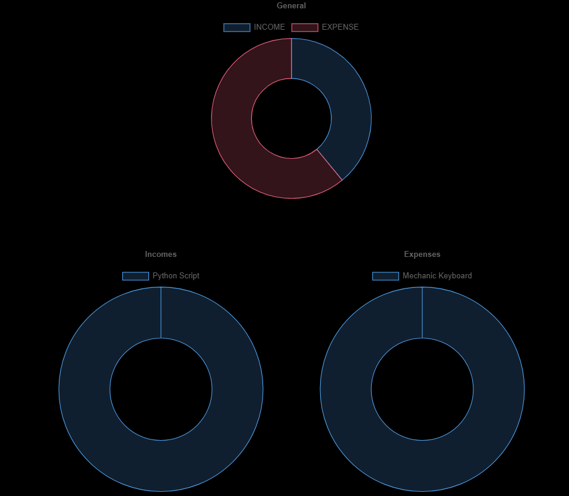
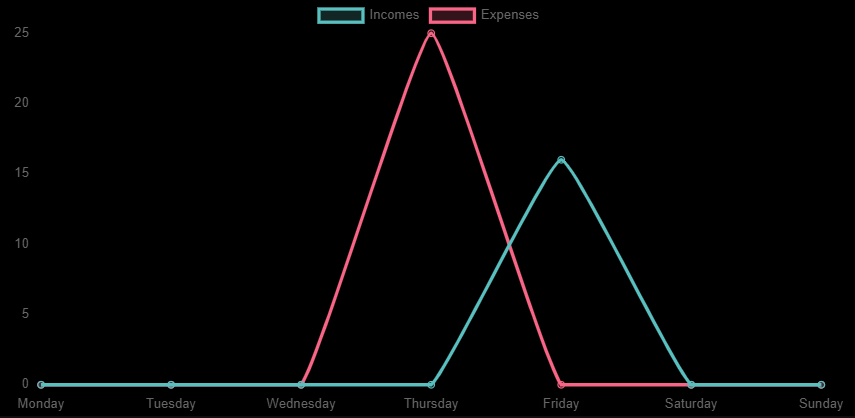
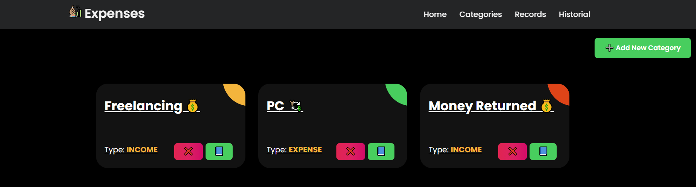
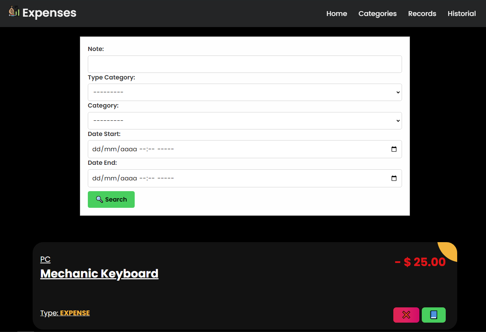

## Django Expenses Dashborad 💹

This project implement a custom role based authentication in FastAPI with JWT

<p align="center">
<a href="https://www.djangoproject.com/" target="blank"></a>
</p>


### How works? 🔧

1. First, you need to setup the environment vars in `setting.py`

```python
DATABASE_NAME=
DATABASE_USER=
DATABASE_PASSWORD=
DATABASE_HOST=
DATABASE_PORT=
SECRET_KEY=<openssl rand -hex 32>
ALLOWED_HOSTS=localhost,127.0.0.1
```

2. Now, make migrations

```cmd
python .\manage.py migrate
```

3. Finally, run the server

```cmd
python .\manage.py runserver
```

---

### Docker Deploy 🐳

1. To deploy only run the command

```bash
docker-compose up
```

2. Finally, make the migrations 

```bash
docker-compose exec web python manage.py migrate
```

---


# How works?

### Home Page

You will see an statistics charts with useful information

1. General charts with total `incomes` and `expenses`, and 2 charts more with details about your **incomes** and **expenses**



2. The second chart is a summary of `incomes` and `expenses` for the current week.



>[!IMPORTANT]
> Probably you won't see nothing if is the first time you set up the server


### Categories Page

You can manage your categories.



>[!IMPORTANT]
> **`Type`** field have 2 static values `INCOME` (💹) and `EXPENSE` (📉)


### Records Page

In this page, you create the records about your finances. If you create a record with a **Income Category** the amount will be positive, otherwise, if you create a record with **Expense Category** the amoun will be negative.


### Historial Page

Here, you can filter the records. Search in the `Note`, filter for a specific `Type Category`, for `Category` and in `Date Range` (All of this fields are optional)




