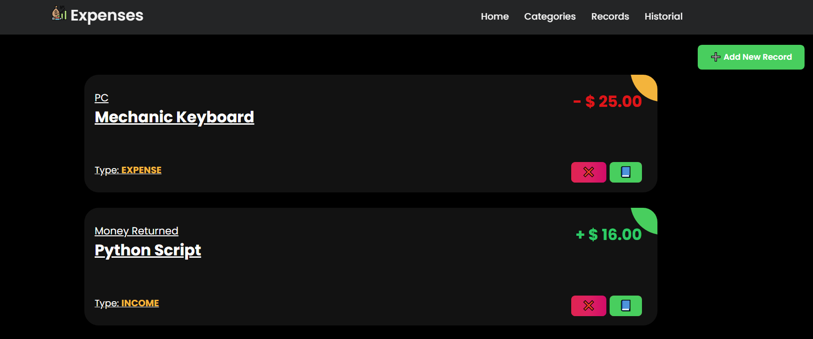

## Django Expenses Dashborad 💹

This project implement a custom role based authentication in FastAPI with JWT

<p align="center">
<a href="https://www.djangoproject.com/" target="blank"></a>
</p>


### How works? 🔧

1. First, you need to setup the environment vars in `setting.py`

```python
SECRET_KEY = '<SETUP SECRET KEY>'

DATABASES = {
    'default': {
        'ENGINE': 'django.db.backends.mysql',
        'NAME': 'expenses',
        'USER': '<USER>',
        'PASSWORD': '<PASSWORD>',
        'HOST': 'localhost',
        'PORT': '3306',
    }
}
```


2. Now, make migrations

```cmd
python .\manage.py migrate
```

3. Finally, run the server

```cmd
python .\manage.py runserver
```

---

# How works?

### Home Page

You will see an statistics charts with useful information

1. General charts with total `incomes` and `expenses`, and 2 charts more with details about your **incomes** and **expenses**


2. The second chart is a summary of `incomes` and `expenses` for the current week.


>[!IMPORTANT]
> Probably you won't see nothing if is the first time you set up the server


### Categories Page

You can manage your categories.


>[!IMPORTANT]
> **`Type`** field have 2 static values `INCOME` (💹) and `EXPENSE` (📉)


### Records Page

In this page, you create the records about your finances. If you create a record with a **Income Category** the amount will be positive, otherwise, if you create a record with **Expense Category** the amoun will be negative.




### Historial Page

Here, you can filter the records. Search in the `Note`, filter for a specific `Type Category`, for `Category` and in `Date Range` (All of this fields are optional)


